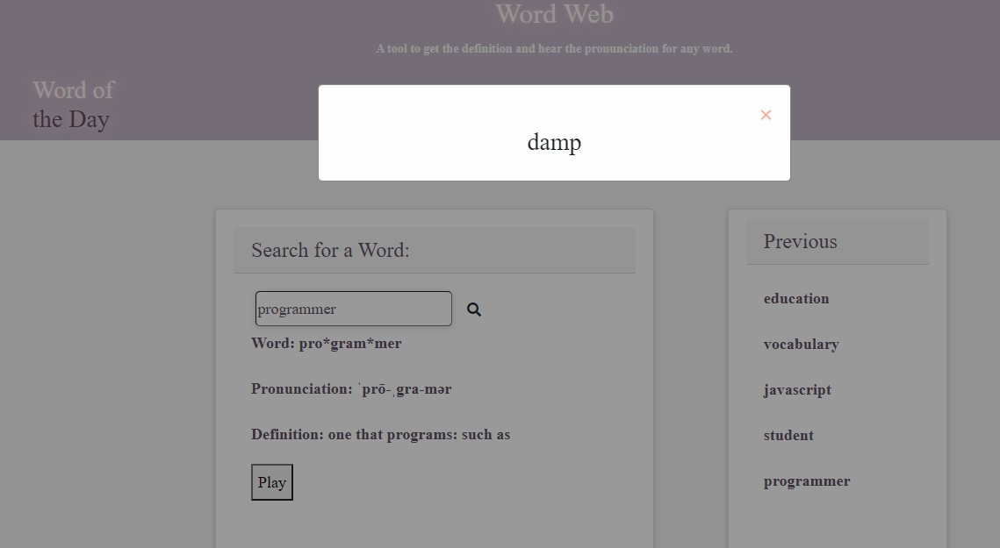

# Word Web
* Application Name

# our_app_
* Dictionary app that allows user to search for a term returns definition, pronunciation and a new word of the day.  Provides more learning than bargained for! For those that are avid learners and looking to “hear the word pronounced correctly”

## Built With
* HTML 5
* CSS 3
* javaScript 
* jquery 3.4.1
* moment js 2.24
* bootstrap 4.3.1
* font-awesome 5.11.2
* server side api used:
    1. "https://dictionaryapi.com/" - (dictionary app) to retrieve definition data for input text to retrieve definitions and display on UI to USER. 
    2. "https://rapidapi.com/dpventures/api/wordsapi/endpoints" - This is the api used to retrieve the word of the day.

## User Story
* I WANT to see the definitions to searched term

## Acceptance Criteria
* GIVEN a word entered into the search form 
* WHEN I view a searched word
* THEN I am presented with current definition for the searched word
* THEN I am presented with synonyms 
* THEN I am presented with the pronunciation
* THEN I am presented with the last 5 words from page loads 
* WHEN I click the play button
* THEN I hear the audio of the pronunciation
* WHEN I load the Word(s) of the Day 
* THEN the word(s) of the day appears in a modal and doesn’t repeat in the same day

## Website
https://queen-stack.github.io/our_app_project/
 * Access requires internet service

## Tested on the following browser
Devices and Browsers used:
* Windows 10 (64 bit) - Chrome: 85, Edge(Chromium): 85, Firefox: 80, IE11: 11.5
* OS X (Beta Big-Sur) (64 bit) - Safari: 14, Chrome: 85, Edge(Chromium): 85, Firefox: 80 
* IE not supported

## Future Enhancement
* edge bug fix
* translator
* pronunciation of the definition

## Author
* Brian Lopez https://github.com/brianslopez
* Ann-Marie Orozco https://github.com/ann760
* Jenifer Queen https://github.com/queen-stack
* Michael Dreesen https://github.com/mdreesen