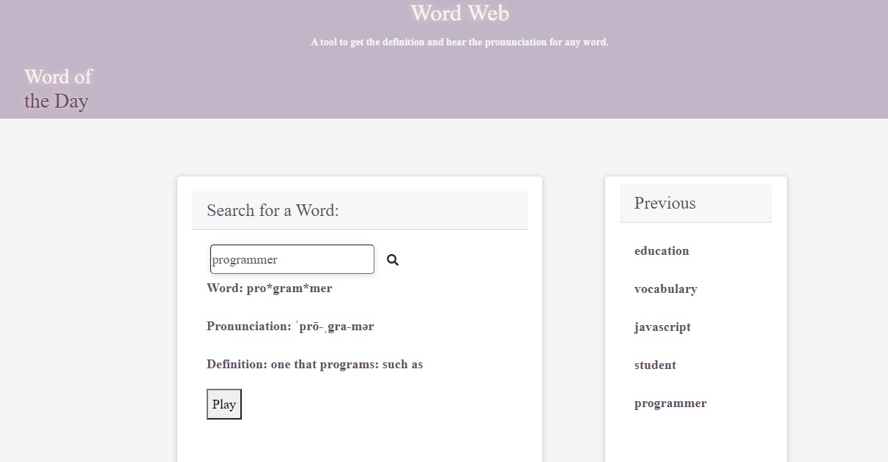

# Word Web

# our_app_
Definition app

## Built With
* HTML
* CSS
* js
* booststrap
* server side api used:
    1. "https://od-api.oxforddictionaries.com/api/v2/" dictionary app) to retrieve definition data for input text to retrieve definitions and display on UI to USER. 
    2. 

##User Story

I WANT to see the definitions to searched term

##Acceptance Criteria
GIVEN a word is input into the dashboard 
THEN I am presented with current definition for the searched term
WHEN I view a searched term
THEN I am presented with synonyms 
WHEN I load the page word of the day appears and doesn’t repeat in the same day 

## Website
https://ann760.github.io/weather/

## Author
Brian Lopez
Ann-Marie Orozco
Jennifer Queen
